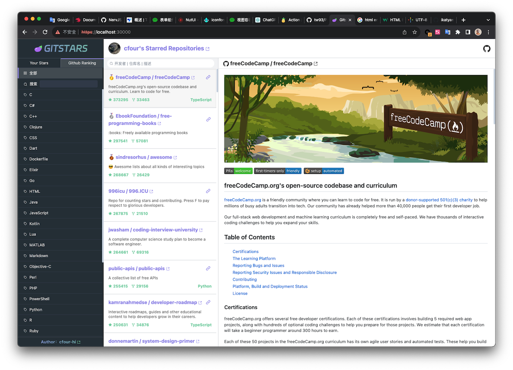
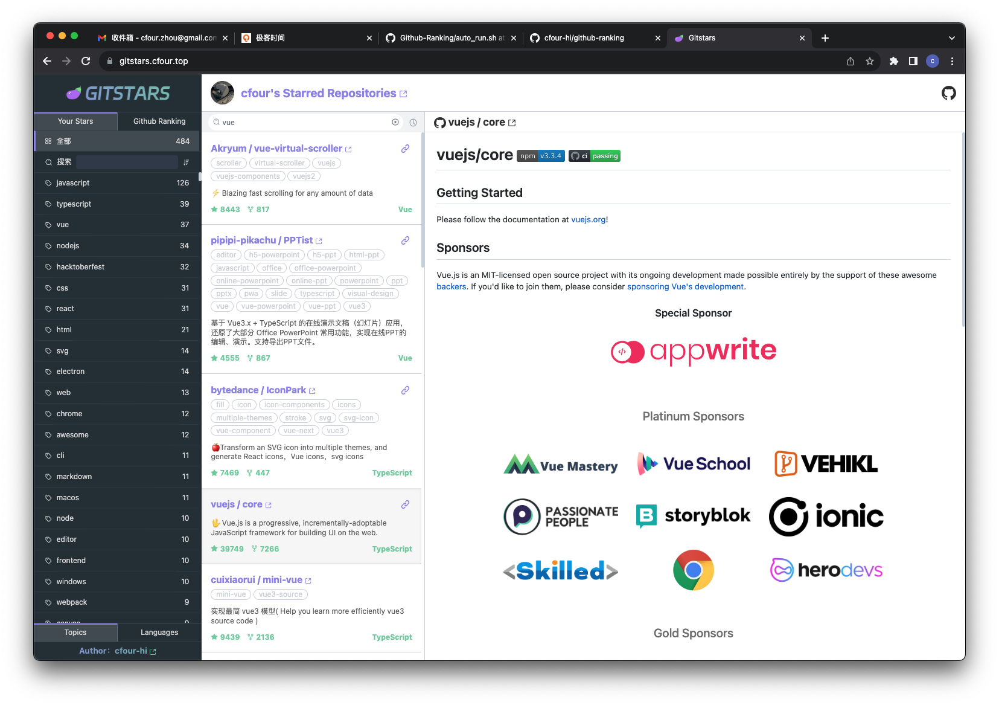
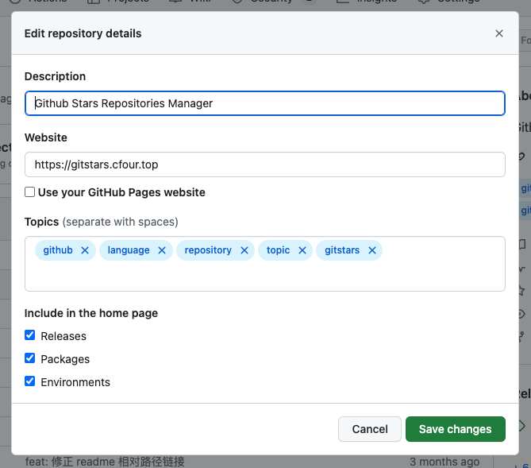
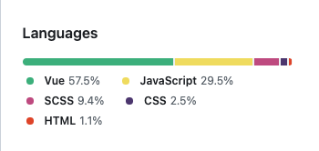

[简体中文](./README.md) / English

Github Stars Repositories Manager

## 🎯 Background

As the first social platform for developers, Github has countless excellent open source projects, which brings great convenience to work and study. When you encounter a project you need or like, just click Star to get it.

Star is easy, but as the number of Starred Repositories grows, it is inevitable that you can’t remember the name of a certain project when you need to use it, and Github only provides a simple search, so finding the target Starred Repository has become a little troublesome.

Therefore, having your own Github Stars Repositories Manager is also a must-have for developers. 💡

## 👀 Discover good projects: Gitstars Ranking (2023-09-09)

<strong>Gitstars Ranking</strong>: Helps you discover the top 100 good projects with the number of Github Stars. It supports various programming language categories and is updated daily.

## 🚀 Quickly find your Star’s warehouse: Your Stars

<strong>Your Stars</strong>: Organize your Stars warehouse and classify it according to Topics and Language to help you quickly find target projects.

## 👻 Other features

- <strong>README.md preview</strong>: No need to jump to Github to view README.md, you can view it on Gitstars;
- <strong>Direct link</strong>: Github warehouse, project website;

## 📖 illustrate

### Topics: Warehouse label set

The tag set is defined by the Repository author and is generally keywords related to the Repository, mostly in English.

### Language: The main programming language of the warehouse

Github will statistically analyze the files of the Repository and determine the main programming language of the Repository.

## 🤖 Vercel deployment

[WIKI Vercel deployment](https://github.com/cfour-hi/gitstars/wiki/Vercel-%E9%83%A8%E7%BD%B2)
