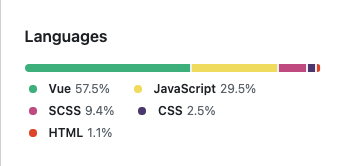

简体中文 / [English](./README-EN.md)

Github Stars 存储库管理器

## 🎯 背景

Github 作为开发者的第一社交平台，拥有数不胜数的优秀开源项目，给工作和学习带来巨大方便，遇到自己需要或是喜爱的项目只需点击 Star 便可收入囊中。

Star is easy，可随着 Starred Repositories 增长，在需要使用到某个项目时难免记不清叫什么，而 Github 又只提供简单的搜索，找到目标 Starred Repository 竟也成了件小小的麻烦事。

所以拥有自己的 Github Stars Repositories Manager 也算是开发者的必备需求。

Gitstars 由此诞生 💡

## 👀 发现好项目：Gitstars Ranking（2023-09-09）

<strong>Gitstars Ranking</strong>：帮助你发现 Github Stars 数量排名前 100 的好项目，支持各种编程语言分类，每日更新。

## 🚀 快速找到自己 Star 的仓库：Your Stars

<strong>Your Stars</strong>：整理你的 Stars 仓库，根据 Topics 和 Language 进行分类，帮助你快速找到目标项目。

## 👻 其它特性

- <strong>README.md 预览</strong>：无需跳转到 Github 查看 README.md，在 Gitstars 即可查看。
- <strong>链接直达</strong>：Github 仓库、项目 Webiste；

## 📖 说明

### Topics：仓库的标签集

标签集由 Repository 作者定义，一般都是与 Repository 相关的关键词，大多以英文为主。

### Language：仓库的主编程语言

Github 会统计分析 Repository 的文件，确定 Repository 的主编程语言。

## 🤖 Vercel 部署

[WIKI Vercel 部署](https://github.com/cfour-hi/gitstars/wiki/Vercel-%E9%83%A8%E7%BD%B2)
