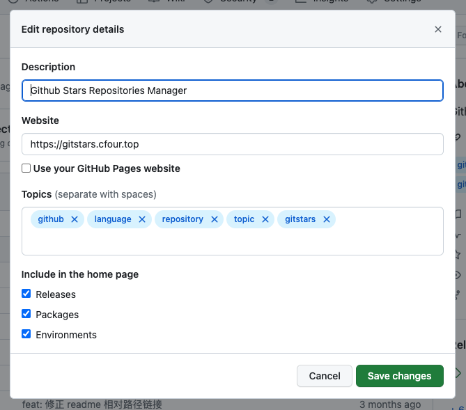

Github 作为开发者的第一社交平台，拥有数不胜数的优秀开源项目，给工作和学习带来巨大方便，遇到自己需要或是喜爱的项目只需点击 Star 便可收入囊中。

Star is easy，可随着 Starred Repositories 增长，在需要使用到某个项目时难免记不清叫什么，而 Github 又只提供简单的搜索，找到目标 Starred Repository 竟也成了件小小的麻烦事。

所以拥有自己的 Github Stars Repositories Manager 也算是开发者的必备需求。

之前有使用过市面上的一些相关工具，比如 Astral。虽说能用，但总觉得不顺手、不好用。

Gitstars 由此诞生 🎉

## Example

## 说明

Gitstars 根据 Topics 和 Language 对 Repositories 进行分类，方便快速找到目标 Repository。

### 什么是 Topics？

Repository 的标签集。

标签集由 Repository 作者定义，一般都是与 Repository 相关的关键词，大多以英文为主。

### 什么是 Language？

Repository 的主编程语言。

Github 会统计分析 Repository 的文件，确定 Repository 的主编程语言。

## 现有问题

### [issues38](https://github.com/cfour-hi/gitstars/issues/38) - Github 授权后页面一直处于加载中，无法进入主页面。

原因：GitHub 授权后获取 access_token 失败

GitHub API 20.205.243.166 节点偶现连接超时，暂时没有想到好的解决方案，希望有大佬能提供支持。

## Vercel 部署

[WIKI Vercel 部署](https://github.com/cfour-hi/gitstars/wiki/Vercel-%E9%83%A8%E7%BD%B2)
